# RustShark 🦈

基于 Rust 全栈开发的网络抓包管理平台，前后端编译为单一二进制文件。

## 功能特性

- **多用户 SaaS**：管理员邀请制注册，用户数据完全隔离
- **SSH 服务器管理**：支持密钥和密码两种认证方式，SSH 私钥加密存储
- **网络抓包**：远程调用 tcpdump，支持网卡选择、BPF 过滤器、定时/重复任务
- **在线分析**：集成 sharkd（Wireshark 守护进程），浏览器内分析 PCAP 文件
- **PCAP 下载**：捕获文件存储在后端，支持下载
- **单二进制部署**：前端 WASM 通过 rust-embed 嵌入后端二进制

## 界面预览

### 仪表盘

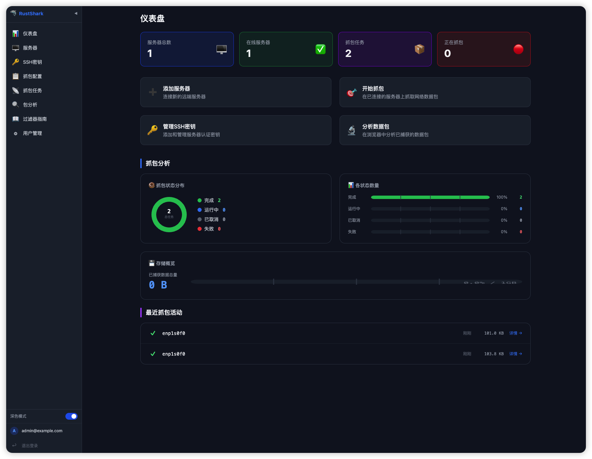

### 服务器管理 & SSH 密钥

<table>
  <tr>
    <td>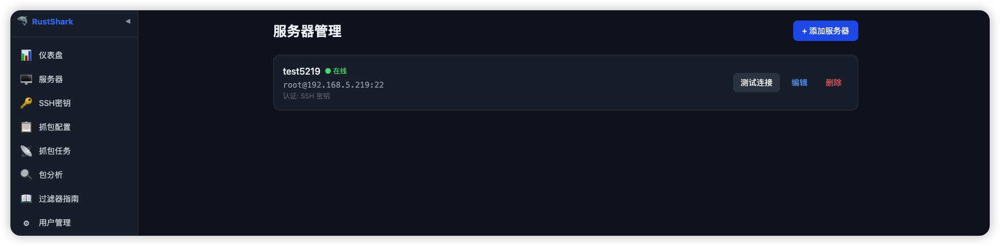<br/><sub>服务器列表</sub></td>
    <td>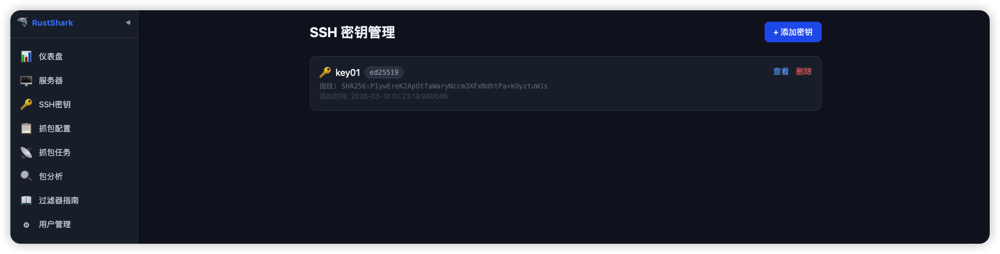<br/><sub>SSH 密钥列表</sub></td>
  </tr>
</table>

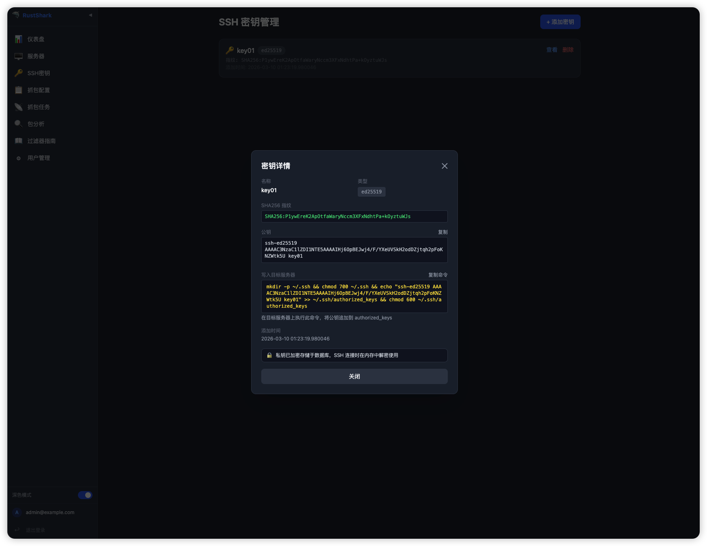

### 抓包配置 & 任务

<table>
  <tr>
    <td>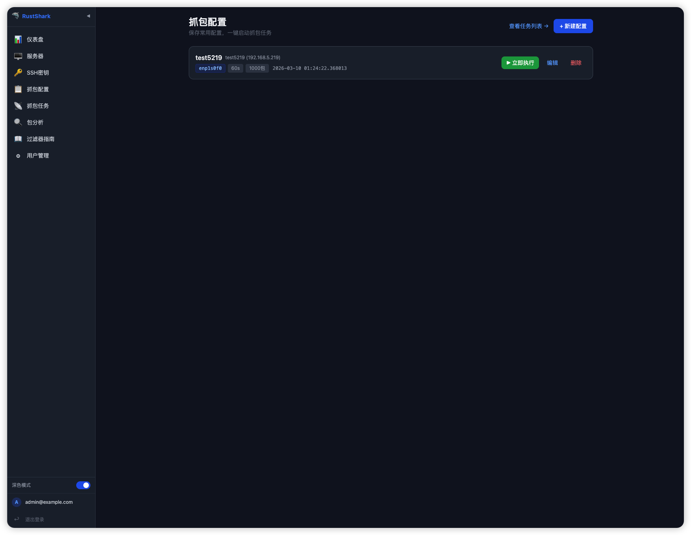<br/><sub>抓包配置列表</sub></td>
    <td>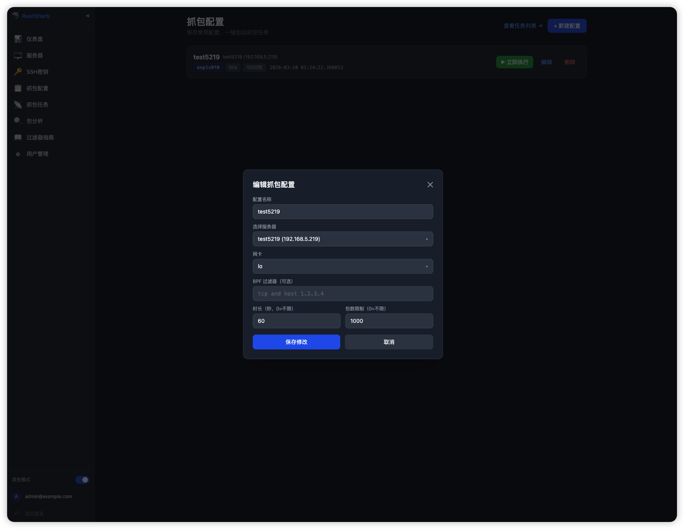<br/><sub>新建 / 编辑配置</sub></td>
  </tr>
</table>

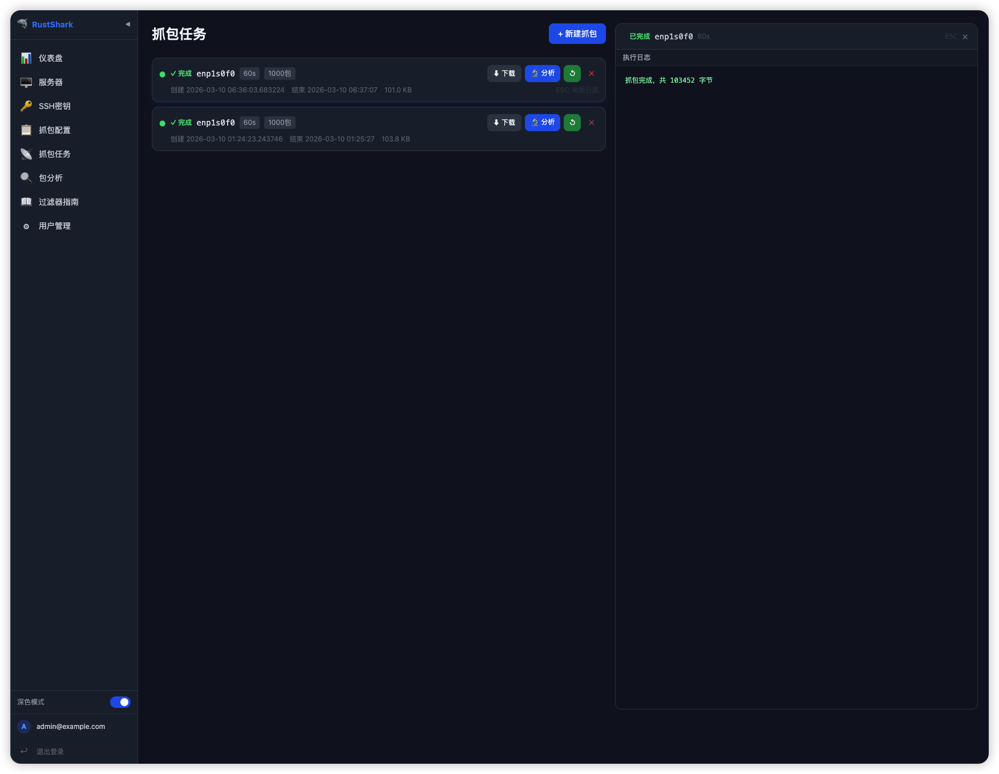

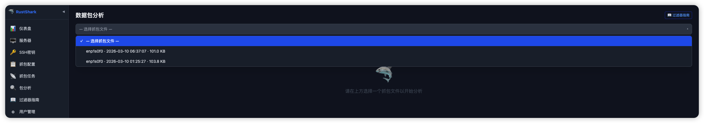

### 包分析

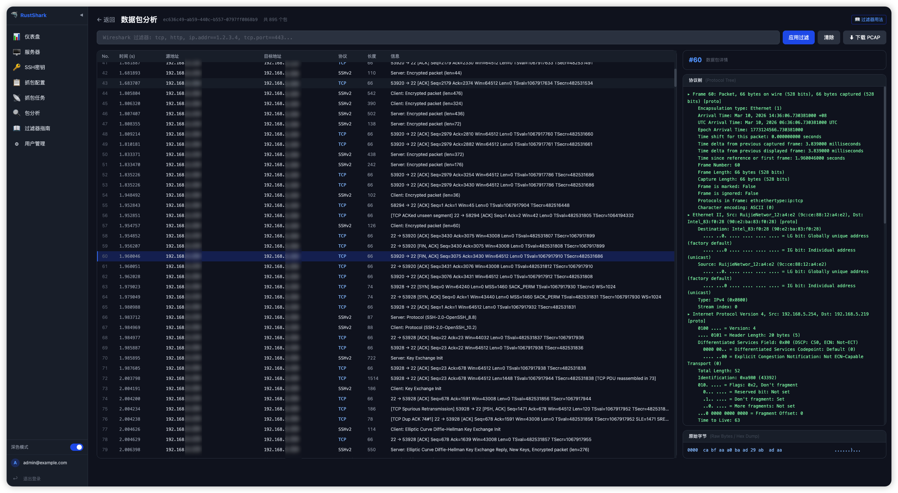

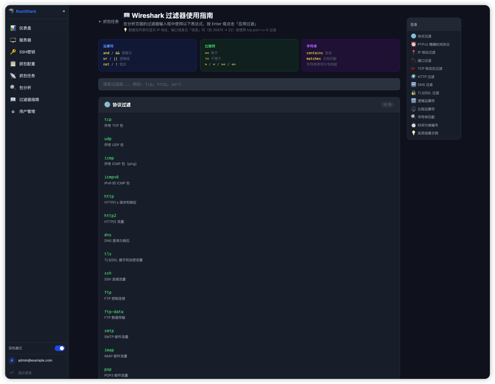

### 用户管理

<table>
  <tr>
    <td>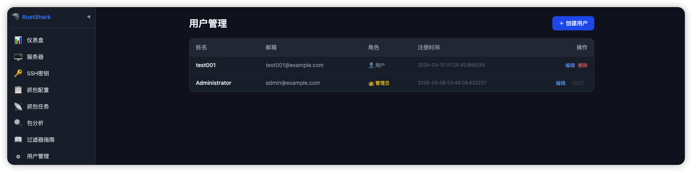<br/><sub>用户管理</sub></td>
    <td>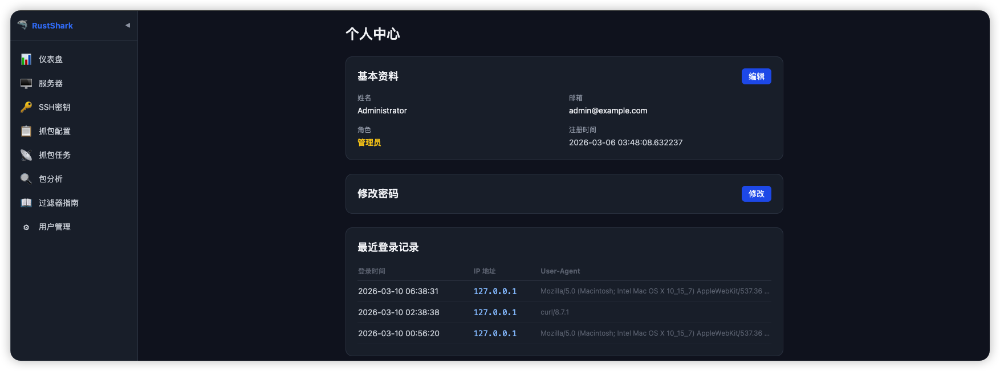<br/><sub>用户个人资料</sub></td>
  </tr>
</table>

## 技术栈

| 层级 | 技术                                |
| ---- | ----------------------------------- |
| 前端 | Leptos 0.7 (CSR/WASM) + TailwindCSS |
| 后端 | Axum 0.8 + SQLite (sqlx 0.8)        |
| 认证 | JWT + bcrypt                        |
| 加密 | AES-256-GCM（SSH 密钥/密码存储）    |
| SSH  | openssh 0.11（基于系统 OpenSSH）    |
| 构建 | Trunk (WASM) + Cargo                |
| 部署 | Docker + docker-compose             |

## 项目结构

```bash
rust-shark/
├── backend/               # Axum 后端
│   ├── src/
│   │   ├── api/           # HTTP 路由处理器
│   │   ├── models/        # 数据模型
│   │   ├── services/      # SSH、加密、抓包、调度器
│   │   ├── db/            # SQLite 连接与迁移
│   │   └── bin/
│   │       └── create_admin.rs  # 创建管理员 CLI 工具
│   └── scripts/           # 后端启停脚本
├── frontend/              # Leptos 前端 (WASM)
│   ├── src/
│   │   ├── pages/         # 各页面组件
│   │   ├── components/    # 公共组件
│   │   ├── api.rs         # HTTP 请求封装
│   │   └── store.rs       # 全局认证状态
│   └── scripts/           # 前端启停脚本
├── assets/
│   └── binaries/          # tcpdump/sharkd 预编译二进制（linux/amd64, arm64）
├── deploy/                # Docker 部署文件
│   └── docker-compose.yml
├── docs/                  # 设计文档
├── .env                   # 本地开发环境变量
├── Dockerfile             # 多阶段构建
└── justfile               # 常用命令快捷方式
```

## 本地开发

### 前置依赖

```bash
# Rust 工具链
curl --proto '=https' --tlsv1.2 -sSf https://sh.rustup.rs | sh

# WASM 编译目标
rustup target add wasm32-unknown-unknown

# Trunk（前端构建工具）
cargo install trunk

# （可选）just 命令运行器
cargo install just
```

### 启动开发环境

需要两个终端分别运行前后端：

**终端 1 — 后端**（监听 http://localhost:17823）

```bash
cd backend
./scripts/dev.sh
# 或直接: cargo run
```

**终端 2 — 前端**（监听 http://localhost:18934，代理 /api 到后端）

```bash
cd frontend
./scripts/dev.sh
# 或直接: trunk serve
```

浏览器访问 **http://localhost:18934**

### 创建管理员账号

首次使用需要创建管理员（后端首次启动后执行）：

```bash
cd backend
cargo run --bin create-admin -- <邮箱> <密码> <名称>

# 示例
cargo run --bin create-admin -- admin@example.com mypassword Admin
```

> **本地开发默认账号**：`admin@example.com` / `admin123`（已通过上述命令创建）
>
> ⚠️ 生产环境请务必使用强密码并修改 `.env` 中的 `SECRET_KEY` 和 `JWT_SECRET`。

### 环境变量

编辑项目根目录的 `.env` 文件：

```env
HOST=0.0.0.0
PORT=17823
DATABASE_URL=sqlite://data/rust-shark.db?mode=rwc
SECRET_KEY=<32位以上随机字符串，用于加密SSH密钥>
JWT_SECRET=<32位以上随机字符串，用于签发JWT>
JWT_EXPIRY_HOURS=24
DATA_DIR=data
RUST_LOG=info
```

### 脚本说明

```bash
# 后端（在 backend/ 目录下）
./scripts/dev.sh      # 前台启动（实时日志）
./scripts/start.sh    # 后台启动
./scripts/stop.sh     # 停止（pid文件 + 进程名 + 端口三重查找）
./scripts/restart.sh  # 重启
./scripts/status.sh   # 状态 + 健康检查

# 前端（在 frontend/ 目录下）
./scripts/dev.sh      # 前台启动（热更新）
./scripts/start.sh    # 后台启动
./scripts/stop.sh     # 停止
./scripts/restart.sh  # 重启
./scripts/status.sh   # 状态
```

## 构建单一二进制

```bash
# 1. 构建前端 WASM
cd frontend && trunk build --release

# 2. 构建后端（自动嵌入 frontend/dist/）
cd ..
cargo build --release --manifest-path backend/Cargo.toml

# 生成的二进制
./target/release/rust-shark
```

## Docker 部署

```bash
cd deploy

# 复制并修改环境变量
cp .env.example .env  # 编辑 SECRET_KEY 和 JWT_SECRET

# 启动
docker compose up -d

# 创建管理员
docker exec rust-shark /app/create-admin admin@example.com mypassword Admin

# 查看日志
docker compose logs -f
```

服务运行在 **http://your-server:17823**

## CI/CD

推送版本标签自动触发 GitHub Actions：

```bash
git tag v1.0.0
git push origin v1.0.0
```

会自动：

1. 构建 linux/amd64 和 linux/arm64 二进制
2. 构建多平台 Docker 镜像并推送到 ghcr.io
3. 创建 GitHub Release 并附带二进制制品

## API 简览

| 方法     | 路径                         | 说明                 |
| -------- | ---------------------------- | -------------------- |
| POST     | `/api/auth/login`            | 登录                 |
| GET      | `/api/auth/me`               | 当前用户信息         |
| GET/POST | `/api/keys`                  | SSH 密钥管理         |
| GET/POST | `/api/servers`               | 服务器管理           |
| POST     | `/api/servers/:id/test`      | 测试连接             |
| GET/POST | `/api/captures`              | 抓包任务             |
| GET      | `/api/captures/:id/download` | 下载 PCAP            |
| GET      | `/api/captures/:id/packets`  | 数据包列表（sharkd） |
| GET      | `/api/stats`                 | 统计数据             |
| GET      | `/api/health`                | 健康检查             |

## License

MIT
